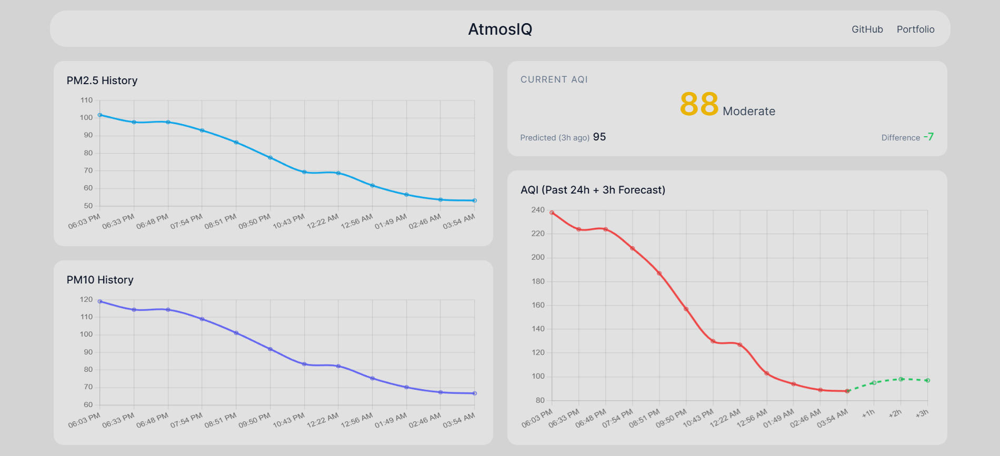
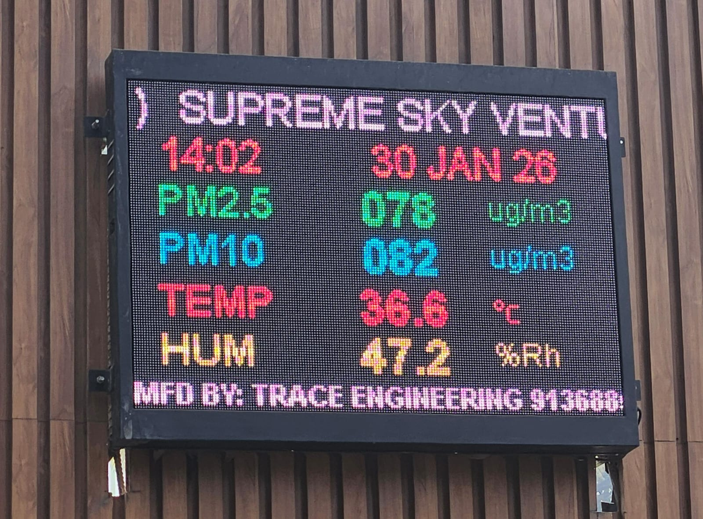
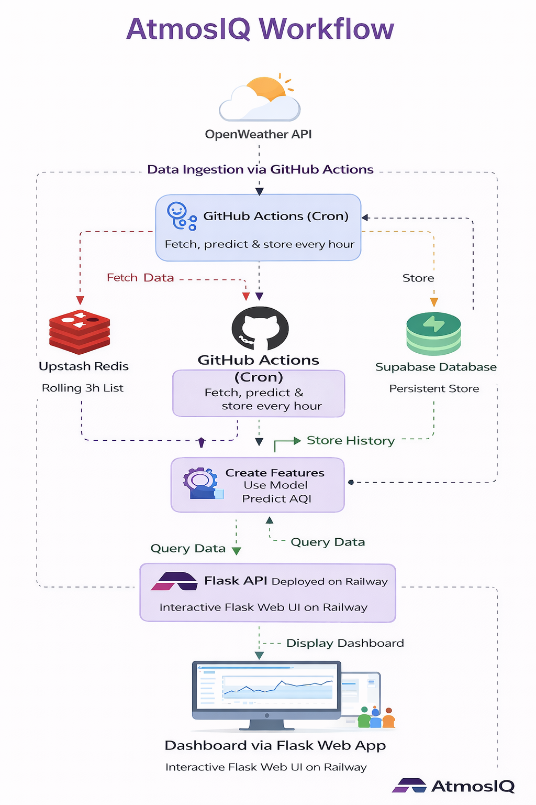

# AtmosIQ — Air Quality Prediction Dashboard

AtmosIQ is an end-to-end air quality monitoring and forecasting system that collects real-time pollution data, predicts future PM-based AQI using a machine learning model, and visualizes insights through a modern web dashboard.

The system is fully automated, scalable, and production-ready, combining GitHub Actions, Redis, Supabase, Flask, and ML forecasting.

## 🚀 Live Demo

Dashboard: https://atmosiq.up.railway.app/



## Why PM-Based AQI



AtmosIQ calculates AQI using PM2.5 and PM10 only, reflecting real-world monitoring practices.

As shown above, public air-quality display boards in Mumbai primarily report PM2.5 and PM10, which usually dominate AQI values in urban Indian environments.

Reasoning
- PM2.5 & PM10 have the highest health impact
- They show the strongest correlation with AQI
- They are the most consistently available pollutants
- AQI is typically reported as the maximum PM sub-index

Including additional gases (NO₂, SO₂, CO, O₃) would reduce reliability due to sparse and inconsistent data.
AtmosIQ prioritizes accuracy, availability, and real-world relevance.

## Key Features

- Hourly automated data ingestion using GitHub Actions
- Rolling short-term memory using Redis (last 3 hours)
- ML-based AQI prediction (3 hours ahead)
- Persistent historical storage in Supabase
- Real-time dashboard with:
- PM2.5 & PM10 trends
- Current AQI with category
- Past 24h AQI history
- 3h AQI forecast
- Clean glass-morphism UI built with Flask + Chart.js
- Zero manual intervention once deployed

## System Architecture



OpenWeather API
        ↓
GitHub Actions (Cron Job, Hourly)
        ↓
Redis (Rolling 3-Hour Buffer)
        ↓
Feature Engineering + ML Prediction
        ↓
Supabase (Persistent Database)
        ↓
Flask API (Railway)
        ↓
Interactive Dashboard

### Important

- Redis is used only inside GitHub Actions
- Flask never connects to Redis
- Flask only reads from Supabase
- All writes happen via GitHub Actions

## Machine Learning Model

- Model: RandomForestRegressor

- Prediction Horizon: 3 hours ahead

- Target: PM-based AQI

- Features:
PM2.5, PM10
Temperature, humidity, wind speed/direction
Lag features (1h, 2h)
Rolling mean (3h)
Time features (hour, month)

- Evaluation:
R² ≈ 0.85
MAE ≈ 13
RMSE ≈ 21
The trained model is saved and reused in production.

## Project Structure

```
AtmosIQ/
│
├── backend/
│   ├── app/
│   │   ├── app.py              # Flask app (API + dashboard)
│   │   ├── templates/
│   │   │   └── dashboard.html
│   │   └── static/
│   │       ├── style.css
│   │       └── main.js
│   │
│   ├── fetcher/
│   │   ├── fetcher.py          # GitHub Actions job
│   │   └── aqi_service.py      # Redis → features → prediction
│   │
│   └── model/
│       └── rf_aqi_model.pkl    # Trained ML model
│
├── dataset/
│   └── mum-byculla-bmc-2024-25.csv
|
├── notebook/
│   └── notebook.ipynb #notebook
│
├── .github/workflows/
│   └── air_quality_cron.yml    # Hourly GitHub Actions workflow
│
├── requirements.txt
└── README.md

```

## Automation Pipeline (GitHub Actions)

- Runs every hour
- Fetches air quality + weather data from OpenWeather
- Stores last 3 readings in Redis
- Builds features & predicts AQI (3h ahead)
- Stores results in Supabase

## Tech Stack

Layer	      Technology

Data Source	  OpenWeather API
Scheduler	  GitHub Actions (Cron)
Cache	      Redis (Upstash)
ML	          scikit-learn
Database	  Supabase (PostgreSQL)
Backend	      Flask
Frontend	  HTML, CSS, JavaScript
Charts	      Chart.js
Hosting	      Railway

## Dashboard Highlights

- PM2.5 & PM10 history charts

- Current AQI card
     Category (Good / Moderate / Poor / Very Poor)
     Predicted AQI for the same hour (from 3h ago)
     Difference indicator

- Combined AQI chart
     Past 24 hours actual AQI
     Next 3 hours forecast (dashed line)

## Future Improvements

- Multi-city support
- Model retraining pipeline
- Longer forecast horizon
- Health impact insights
- User alerts for AQI spikes